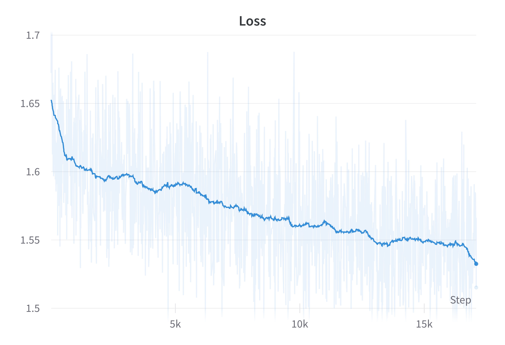
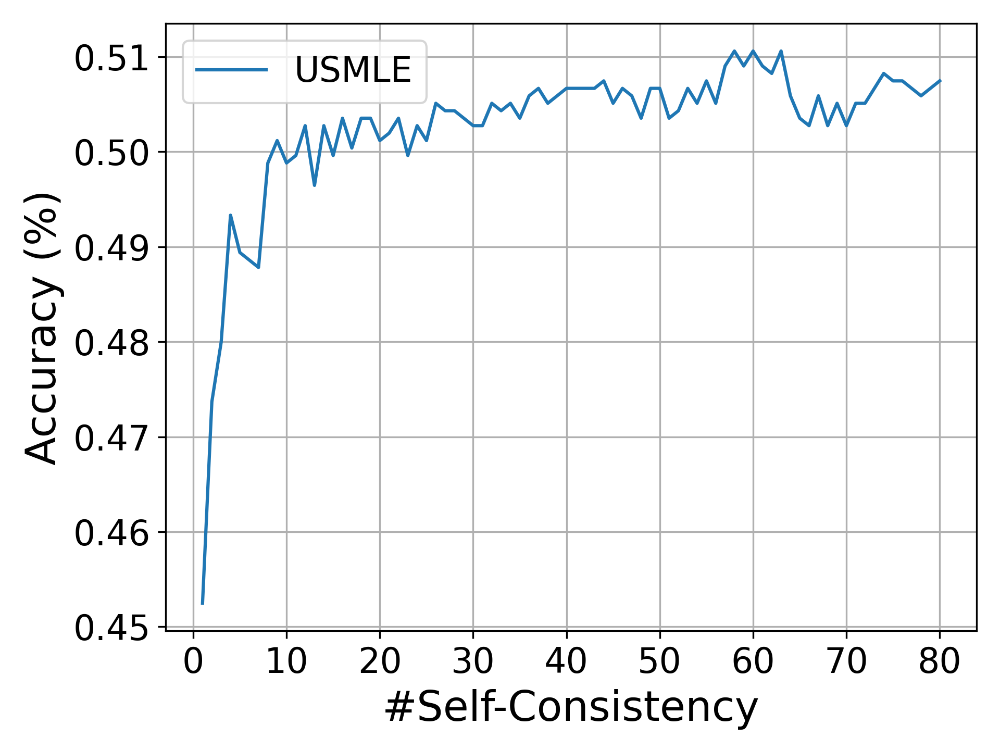

# BioMed-LLaMA

Biomedical foundation model: Continuous pretraining LLaMA with Pile/PubMed

## Introduction

BioMed-LLaMA-7b is a 7b large language model (LLM) pretrained continuously from MetaAI's LLaMA-7b on biomedical abstracts and papers from The Pile, namely, the PubMed-abstract and PubMed-central subsets.

## Pretraining resources

[The Pile](http://pile.eleuther.ai/) is a large-scale high-quality dataset of diverse text sources that is designed to be used for pretraining large language models. It contains 825 GiB of text from 22 diverse sources, including Wikipedia, PubMed abstracts, PubMed Central papers, etc. We extracted the PubMed-abstract and PubMed-central subsets from The Pile as our pretraining resources.

After extraction, we obtained 213 GiB of text containing about 50B tokens. We trained the LLaMA-7b model on these data for 1 epoch to avoid overfitting to the pretraining data.

## Training Procedure

Since it is a continuous pretraining, we mainly follow the hyperparameters of LLaMA-7b.

The model was trained on an 8-node HPC cluster containing 32 NVIDIA A100-80GB GPUs lasting a week.

We conducted several optimization strategies to speed up training and reduce memory consumption.
+ We used [PyTorch FSDP](https://pytorch.org/docs/stable/fsdp.html) to enable model parallelism. However, since the network bandwidth across nodes in our cluster is limited, we adopted hybrid sharing strategy to reduce node-wise communication cost. 
+ Gradient accumulation is also applied to reduce GPU-wise communication cost.
+ We also used [xformers](https://github.com/facebookresearch/xformers) to conduct effective attention computation to reduce memory consumption and speed up training.
+ Mixed precision training (bf16+tf32) is also used to reduce memory consumption and speed up training. Though the data type of LLaMA's model weights is float16, we didn't observe any difference between fp16 and bf16 training in our preliminary experiments.

|                   |               |
| ------------------- | --------------- |
| max_seq_length    | 2048          |
| lr                | 1e-5          |
| batch size        | 2048          |
| betas             | \[0.9, 0.95\] |
| weight decay      | 0.1           |
| gradient clipping | 1.0           |

### Training Loss Curve

Here below is the curve of training loss, where running average smoothing is applied for visualization.

    
  

## Instruction Tuning
Existing commercial LLMs achieve an excellent performance on medical tasks like USMLE-QA, especially when performing few-shot inference. However, they usually have tremendous number of parameters, so the inference requires many computation resources and time, especially when adding few-shot demonstrations to the inputting prompt. Finetuning on these demonstrations is also impossible. However, our model is quite smaller and we have many downstream tasks to be evaluated, so we conducted instruction tuning with these few-shot examples instead of performing in-context learning.

We collected diverse instruction tuning data from various resources:

| Source | #Sample | Percentage | Domain |
| ------- | --------- | ------ | ------ |
|    USMLE/train     |  10178  |  9.5587%   |    Medical    |
| [AlpacaDataCleaned](https://github.com/gururise/AlpacaDataCleaned)  |  51760  |  48.6105%  |    Open     |
| [visual-med-alpaca](https://github.com/cambridgeltl/visual-med-alpaca)  |  44246  |  41.5537%  |    Medical     |
|   [medpalm_5-shot](https://arxiv.org/pdf/2212.13138.pdf)   |    5    |  0.0047%   |    Medical    |
| [medpalm_5-shot-cot](https://arxiv.org/pdf/2212.13138.pdf) |    5    |  0.0047%   |    Medical    |
|      [mmlu-cot](https://github.com/jasonwei20/flan-2)      |   282   |  0.2648%   |    Science    |
|     [codex-cot](https://arxiv.org/pdf/2207.08143v3.pdf)      |    3    |  0.0028%   |    Medical    |

### CoT ability
After finetuning with some Chain-of-Thought (CoT) data, our model can also perform CoT prompting and therefore unlock some tricks to improve the performance of downstream tasks. 

    
  

## Evaluation
We conducted comparison between vanilla LLaMA-7B, [PMC-LLaMA-7B](https://github.com/chaoyi-wu/PMC-LLaMA), and [BioMedLM](https://github.com/stanford-crfm/BioMedLM).
Note that BioMedLM was trained on the same pretraining resources but more epochs (6 epochs in total producing 300B tokens), and PMC-LLaMA-7B was trained on 4.8M PubMedCentral papers for 5 epochs.

| Model           | #Params | Max_seq_len |PubMed-Abstract/word_ppl | PubMed-Central/word_ppl |
| ----------------- | --------- | --- | -------------------------- | ------------------------- |
| Random          | -       | - | -                        | -                       |
| BioMed-LLaMA-7B | 6.7B    | 2048 | 15.7774                  | **20.9322**             |
| PMC-LLaMA-7B | 6.7B | 2048/512 | | |
| LLaMA-7B        | 6.7B    | 2048 | 20.1107                  | 29.0583                 |
| BioMedLM        | 2.7B    | 1024 | **15.6959**              | 18.6799 (1024)          |

### USMLE (MedQA) - 4 options
We also evaluate models on USMLE examination.
Noted that BioMedLM introduced extra trainable parameters (i.e. linear classifier) for each downstream tasks. In order to produce a unified model for various medical tasks, we didn't introduce linear classifier but finetune all downstream tasks by formulating them as the text generation task.

